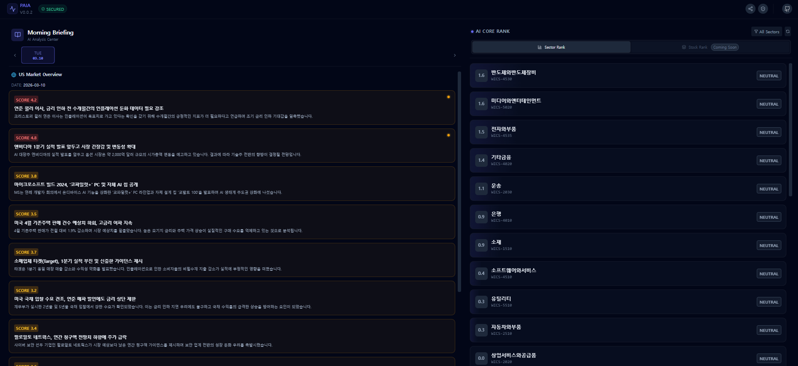

# AI 개인 증권 비서

🖥️[LensPay APSS 사이트](https://apss.lenspay.site)

---
## 🧭소개
APSS(AI Personal Sotck Secretary)는 AI 기반의 개인 증권 비서 서비스입니다.    
복잡한 주식 시장을 쉽게 파악하고, 나만의 투자 전략을 세울 수 있도록 도와줍니다.

여러 사이트를 돌아다니면서 주식에 대한 정보를 찾는것이 귀찮아서 만든 프로젝트입니다.

---
## 주요기능
1. 📊AI 기반 종목 분석: 커뮤니티 혹은 뉴스에 보도된 자료를 AI 기반 점수 엔진을 통해 섹터 점수를 제공
2. 💼포트폴리오 관리:
   - 보유 종목 현황 및 수익률 추적
   - AI 기반 종목 분석을 통한 포트폴리오 위험군 추출
3. 📰뉴스 요약: 실시간 증권 뉴스를 AI가 요약 정리
